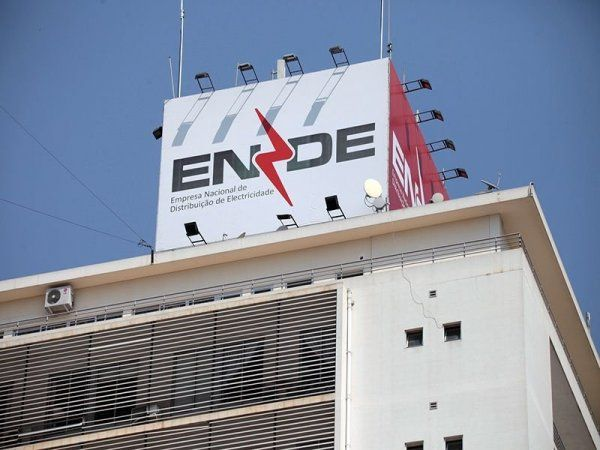
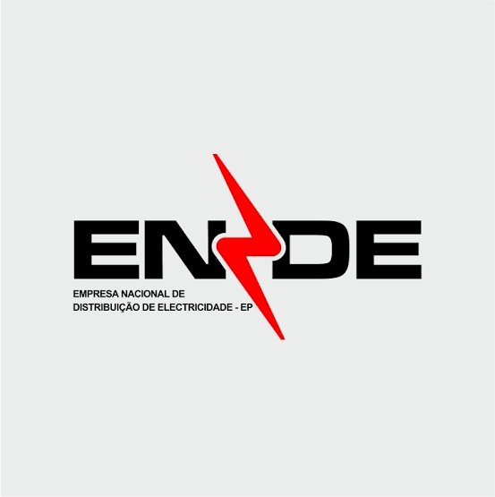

proxima etápa, refatoração visual do projecto, mude a palleta de cores para branco(60%),preto(30%) e vermelho(10%).
adicione  uma página sobre e adicione contexto com essas imagens:

##Esta imagem é para o apoio ao cliente
##Esta é para denuncia

##Esta é demostrativa do logo num edificio
##éste eé o logo(usar em todo site)

também teve um problema e depois de criar conta, aparece perfil não encontrado, verifique esta questão